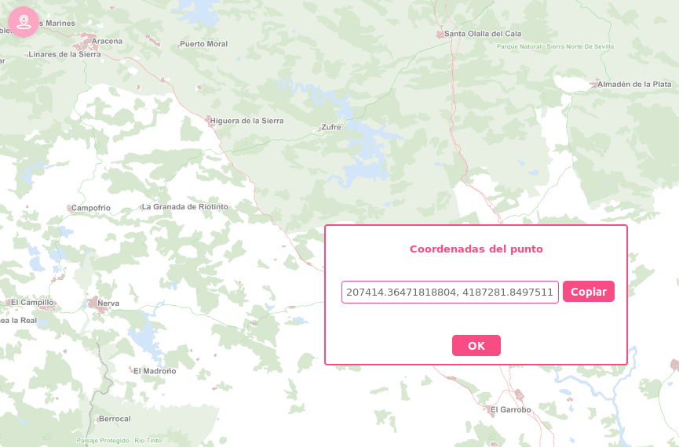

# M.plugin.ShowCoordinates

Plugin que permite obtener las coordenadas del punto sobre el que se pulsa en el mapa.



## Dependencias

- showcoordinates.ol.min.js
- showcoordinates.ol.min.css


```html
 <link href="../../plugins/showcoordinates/showcoordinates.ol.min.css" rel="stylesheet" />
 <script type="text/javascript" src="../../plugins/showcoordinates/showcoordinates.ol.min.js"></script>
```

## Parámetros

- El constructor se inicializa con un JSON de _options_ con los siguientes atributos:

- **position**. Indica la posición donde se mostrará el plugin
  - 'TL':top left
  - 'TR':top right (default)
  - 'BL':bottom left
  - 'BR':bottom right

## Eventos

## Otros métodos

## Ejemplos de uso

### Ejemplo 1
```javascript
  const map = M.map({
    container: 'map'
   });

  const mp = new M.plugin.ShowCoordinates({
    position: 'BR',
  });

   map.addPlugin(mp);
```
### Ejemplo 2
```javascript
  const map = M.map({
    container: 'map'
  });

  const mp = new M.plugin();
  map.addPlugin(mp);
```